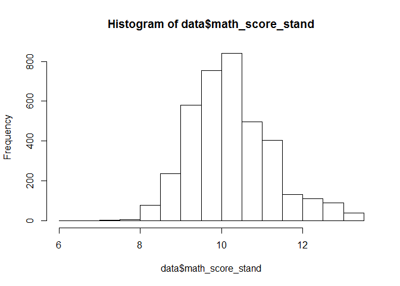
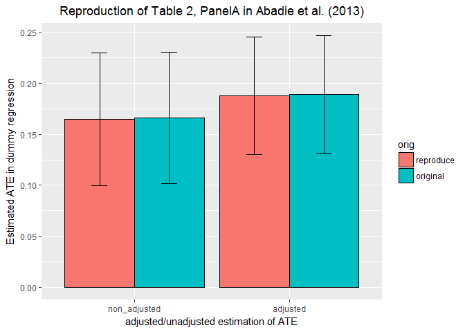
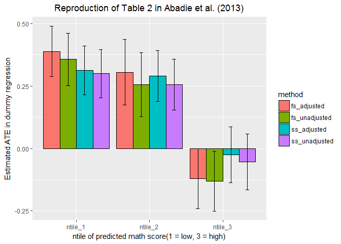
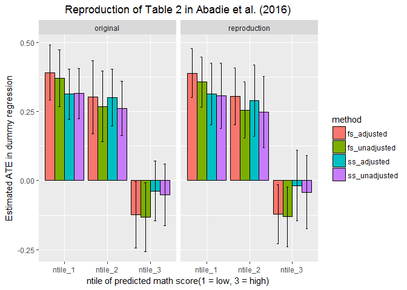

STAR\_Example
================

``` r
library(haven)
```

    ## Warning: package 'haven' was built under R version 3.3.3

``` r
library(tidyr)
```

    ## Warning: package 'tidyr' was built under R version 3.3.3

``` r
library(dplyr)
library(ggplot2)
```

    ## Warning: package 'ggplot2' was built under R version 3.3.3

``` r
library(stRatification)
```

Setup
-----

### Download & Read STAR dataset

The data set is downloadable from this page <https://ideas.repec.org/p/boc/bocins/webstar.html>. if you are interested in the definition of each column, see the following link <http://wise.xmu.edu.cn/course/gecon/star_Description.pdf>.

``` r
data <- read_dta("http://fmwww.bc.edu/ec-p/data/stockwatson/star_sw.dta")
```

### mutate column names into more close to the expression in the paper

as a result we get n = 3784, which is slightly larger than the number in the paper.

``` r
data <- data %>%
  filter(rak != 1) %>%
  mutate(math_score = tmathssk,
         small_class = sck,
         female = ifelse(boy == 1, 0, 1),
         black = ifelse(black == 1, 1, 0),
         free_lunch = freelunk,
         school_attended = schidkn %>% as.factor()
  ) %>%
  select(math_score, small_class, female, black, free_lunch, school_attended)  %>% na.omit()
```

### get the standard deviation inthe regular class, then calculate stardardized math score

``` r
regsd <- data %>% filter(small_class == 0) %>% summarise(regular_sd = sd(math_score))
data <- data %>% mutate(math_score_stand = math_score/regsd$regular_sd)
hist(data$math_score_stand)
```



Reproduction of Table.2 in Alberto(2016)
----------------------------------------

### Panel A: Average treatment effect

#### unadjusted

``` r
reg_nonadj <- lm(data = data, formula = math_score_stand ~ small_class)
summary(reg_nonadj)
```

    ## 
    ## Call:
    ## lm(formula = math_score_stand ~ small_class, data = data)
    ## 
    ## Residuals:
    ##     Min      1Q  Median      3Q     Max 
    ## -4.2620 -0.7170 -0.1081  0.6267  2.9990 
    ## 
    ## Coefficients:
    ##             Estimate Std. Error t value Pr(>|t|)    
    ## (Intercept) 10.14329    0.02263 448.203  < 2e-16 ***
    ## small_class  0.16498    0.03321   4.968 7.08e-07 ***
    ## ---
    ## Signif. codes:  0 '***' 0.001 '**' 0.01 '*' 0.05 '.' 0.1 ' ' 1
    ## 
    ## Residual standard error: 1.019 on 3782 degrees of freedom
    ## Multiple R-squared:  0.006483,   Adjusted R-squared:  0.00622 
    ## F-statistic: 24.68 on 1 and 3782 DF,  p-value: 7.077e-07

#### adjusted

``` r
reg_adj <- lm(data = data, formula = math_score_stand ~ small_class + female + black + free_lunch + school_attended)
summary(reg_adj)
```

    ## 
    ## Call:
    ## lm(formula = math_score_stand ~ small_class + female + black + 
    ##     free_lunch + school_attended, data = data)
    ## 
    ## Residuals:
    ##     Min      1Q  Median      3Q     Max 
    ## -4.4493 -0.5744 -0.0521  0.5254  3.3467 
    ## 
    ## Coefficients:
    ##                   Estimate Std. Error t value Pr(>|t|)    
    ## (Intercept)       10.41469    0.12983  80.220  < 2e-16 ***
    ## small_class        0.18766    0.02938   6.387 1.90e-10 ***
    ## female             0.15226    0.02895   5.260 1.52e-07 ***
    ## black             -0.34774    0.06220  -5.591 2.42e-08 ***
    ## free_lunch        -0.45181    0.03470 -13.022  < 2e-16 ***
    ## school_attended2  -0.83116    0.20122  -4.131 3.70e-05 ***
    ## school_attended3  -0.02542    0.17818  -0.143 0.886579    
    ## school_attended4  -0.71312    0.19662  -3.627 0.000291 ***
    ## school_attended5  -0.69528    0.19227  -3.616 0.000303 ***
    ## school_attended6  -0.47845    0.20451  -2.339 0.019364 *  
    ## school_attended7   0.36811    0.16423   2.241 0.025059 *  
    ## school_attended8  -0.41742    0.16245  -2.570 0.010220 *  
    ## school_attended9  -0.15032    0.16275  -0.924 0.355738    
    ## school_attended10  0.61332    0.20580   2.980 0.002900 ** 
    ## school_attended11  0.16299    0.19820   0.822 0.410938    
    ## school_attended12  0.32151    0.19920   1.614 0.106609    
    ## school_attended13  0.55789    0.19223   2.902 0.003727 ** 
    ## school_attended14  0.26215    0.28159   0.931 0.351943    
    ## school_attended15 -0.11611    0.19688  -0.590 0.555380    
    ## school_attended16 -0.26954    0.18134  -1.486 0.137253    
    ## school_attended17 -0.27427    0.17865  -1.535 0.124809    
    ## school_attended18 -0.28023    0.17781  -1.576 0.115096    
    ## school_attended19 -0.01771    0.18246  -0.097 0.922669    
    ## school_attended20  0.18123    0.20031   0.905 0.365665    
    ## school_attended21  0.35200    0.20001   1.760 0.078502 .  
    ## school_attended22  0.69280    0.16751   4.136 3.62e-05 ***
    ## school_attended23  1.07204    0.17430   6.151 8.54e-10 ***
    ## school_attended24 -0.07210    0.18967  -0.380 0.703877    
    ## school_attended25 -0.18603    0.19449  -0.957 0.338878    
    ## school_attended26 -0.55702    0.20859  -2.670 0.007609 ** 
    ## school_attended27  0.69136    0.16608   4.163 3.21e-05 ***
    ## school_attended28  0.02822    0.16643   0.170 0.865352    
    ## school_attended29  0.41423    0.20534   2.017 0.043732 *  
    ## school_attended30  1.29807    0.20052   6.473 1.08e-10 ***
    ## school_attended31  0.87321    0.20897   4.179 3.00e-05 ***
    ## school_attended32 -0.46605    0.17712  -2.631 0.008543 ** 
    ## school_attended33 -0.58379    0.18460  -3.162 0.001577 ** 
    ## school_attended34 -0.73094    0.18008  -4.059 5.03e-05 ***
    ## school_attended35 -0.45354    0.19345  -2.344 0.019108 *  
    ## school_attended36 -0.64167    0.18713  -3.429 0.000612 ***
    ## school_attended37 -0.20159    0.17832  -1.130 0.258349    
    ## school_attended38 -0.18720    0.21059  -0.889 0.374089    
    ## school_attended39  0.08114    0.18686   0.434 0.664164    
    ## school_attended40  0.72642    0.18615   3.902 9.70e-05 ***
    ## school_attended41  0.48313    0.18506   2.611 0.009074 ** 
    ## school_attended42 -0.43953    0.18085  -2.430 0.015128 *  
    ## school_attended43 -0.19827    0.18278  -1.085 0.278111    
    ## school_attended44  0.96442    0.18186   5.303 1.21e-07 ***
    ## school_attended45 -0.64213    0.20092  -3.196 0.001406 ** 
    ## school_attended46 -0.16690    0.19487  -0.856 0.391805    
    ## school_attended47 -0.25094    0.19835  -1.265 0.205908    
    ## school_attended48  0.20562    0.18291   1.124 0.261003    
    ## school_attended49  0.16232    0.19209   0.845 0.398162    
    ## school_attended50  0.09587    0.17950   0.534 0.593305    
    ## school_attended51 -0.02951    0.15793  -0.187 0.851771    
    ## school_attended52  0.32242    0.20793   1.551 0.121078    
    ## school_attended53 -0.81519    0.19899  -4.097 4.28e-05 ***
    ## school_attended54 -0.33265    0.19983  -1.665 0.096066 .  
    ## school_attended55 -0.47018    0.17415  -2.700 0.006968 ** 
    ## school_attended56 -0.91330    0.16444  -5.554 2.99e-08 ***
    ## school_attended57 -0.56383    0.18705  -3.014 0.002593 ** 
    ## school_attended58  0.21971    0.17924   1.226 0.220359    
    ## school_attended59  0.20283    0.18952   1.070 0.284580    
    ## school_attended60 -0.56610    0.18088  -3.130 0.001763 ** 
    ## school_attended61 -0.32924    0.17914  -1.838 0.066155 .  
    ## school_attended62 -0.38745    0.19845  -1.952 0.050967 .  
    ## school_attended63  0.15219    0.16602   0.917 0.359350    
    ## school_attended64 -0.30356    0.16676  -1.820 0.068784 .  
    ## school_attended65  0.13945    0.22098   0.631 0.528064    
    ## school_attended66 -0.63950    0.18096  -3.534 0.000414 ***
    ## school_attended67  0.06757    0.21549   0.314 0.753859    
    ## school_attended68  0.58216    0.16532   3.521 0.000434 ***
    ## school_attended69  0.42364    0.20191   2.098 0.035954 *  
    ## school_attended70 -0.12706    0.18034  -0.705 0.481130    
    ## school_attended71 -0.43195    0.17599  -2.454 0.014158 *  
    ## school_attended72  0.43956    0.16849   2.609 0.009122 ** 
    ## school_attended73 -0.07230    0.18617  -0.388 0.697770    
    ## school_attended74  0.15298    0.17811   0.859 0.390447    
    ## school_attended75 -0.01899    0.17097  -0.111 0.911577    
    ## school_attended76 -0.21925    0.16400  -1.337 0.181356    
    ## school_attended78 -0.49354    0.19362  -2.549 0.010841 *  
    ## school_attended79  0.04022    0.18728   0.215 0.829977    
    ## school_attended80 -0.06472    0.19991  -0.324 0.746167    
    ## ---
    ## Signif. codes:  0 '***' 0.001 '**' 0.01 '*' 0.05 '.' 0.1 ' ' 1
    ## 
    ## Residual standard error: 0.8796 on 3701 degrees of freedom
    ## Multiple R-squared:  0.2755, Adjusted R-squared:  0.2594 
    ## F-statistic: 17.16 on 82 and 3701 DF,  p-value: < 2.2e-16

#### 

``` r
ate_nonadj <- data.frame(coef = summary(reg_nonadj)$coef["small_class","Estimate"], 
                         stder = summary(reg_nonadj)$coef["small_class","Std. Error"], 
                         adjusted = "non_adjusted",
                         orig = "reproduce")

ate_adj <- data.frame(coef = summary(reg_adj)$coef["small_class","Estimate"], 
                         stder = summary(reg_adj)$coef["small_class","Std. Error"], 
                         adjusted = "adjusted",
                         orig = "reproduce")

ate_ori <- data.frame(coef = c(0.1659, 0.1892),
                      stder = c(0.0329, 0.0294),
                      adjusted = c("non_adjusted", "adjusted"),
                         orig = "original")

panel_a <- rbind(ate_nonadj, ate_adj, ate_ori)

panel_a %>%
  ggplot(aes(y = coef, x = adjusted, fill = orig)) + 
  geom_bar(position = position_dodge(),
           stat = "identity", color = "black") +
  geom_errorbar(data = panel_a,
                aes(ymin = coef - 1.96*stder,
                    ymax = coef + 1.96*stder,
                width = 0.2),
                position = position_dodge(.9)) +
  xlab("adjusted/unadjusted estimation of ATE") +
  ylab("Estimated ATE in dummy regression") +
  ggtitle("Reproduction of Table 2, PanelA in Abadie et al. (2016)") +
  theme(plot.title = element_text(hjust = 0.5))
```



### Panel B: Average treatment effect by predicted outcome group

#### fullsample and unadjusted

``` r
fs_result_unadjusted <- fullsample_stratification(data,
                                                  Y = "math_score_stand",
                                                  treatment = "small_class",
                                                  X = c("female","black","free_lunch","school_attended"),
                                                  adjusted = F,
                                                  ntilen = 3)
```

#### fullsample and adjusted

``` r
fs_result_adjusted <- fullsample_stratification(data,
                                                  Y = "math_score_stand",
                                                  treatment = "small_class",
                                                  X = c("female","black","free_lunch","school_attended"),
                                                  adjusted = T,
                                                  ntilen = 3)
```

#### samplesplit and unadjusted

``` r
ss_result_unadjusted <- sample_splitting_estimation(data,
                                                    Y = "math_score_stand",
                                                    treatment = "small_class",
                                                    X = c("female","black","free_lunch","school_attended"),
                                                    M = 100,
                                                    ntilen = 3,
                                                    adjusted = F)
```

#### samplesplit and adjusted

``` r
ss_result_adjusted <- sample_splitting_estimation(data,
                                                    Y = "math_score_stand",
                                                    treatment = "small_class",
                                                    X = c("female","black","free_lunch","school_attended"),
                                                    M = 100,
                                                    ntilen = 3,
                                                    adjusted = T)
```

### plot table\_2 reproduction

``` r
fs_res <- fs_result_adjusted %>%
  mutate(method = "fs_adjusted") %>%
  rbind(fs_result_unadjusted %>% mutate(method = "fs_unadjusted")) %>%
  select(-M)

ss_res <- ss_result_unadjusted %>% 
  group_by(nt) %>%
  summarise(ATE = mean(ATE), stder = mean(stder)) %>%
  mutate(method = "ss_unadjusted") %>%
  rbind(ss_result_adjusted %>% 
  group_by(nt) %>%
  summarise(ATE = mean(ATE), stder = mean(stder)) %>%
    mutate(method = "ss_adjusted"))

plot_dataset <- rbind(fs_res, ss_res) %>% mutate(origin = "reproduction")

plot_dataset %>%
  ggplot(aes(y = ATE, x = nt, fill = method)) + 
  geom_bar(position = position_dodge(), 
           stat="identity", color = "black") +
  geom_errorbar(data = plot_dataset,
                aes(ymin = ATE - 1.96*stder,
                    ymax = ATE + 1.96*stder,
                    width = 0.2),
                    position = position_dodge(.9)) +
  xlab("ntile of predicted math score(1 = low, 3 = high)") +
  ylab("Estimated ATE in dummy regression") +
  ggtitle("Reproduction of Table 2 in Abadie et al. (2016)") +
  theme(plot.title = element_text(hjust = 0.5))
```



### plot the comparison

``` r
comp_dataset <- data.frame(
  nt = rep(paste("ntile", 1:3, sep = "_"), 4),
  ATE = c(0.3705, 0.2688, -0.133, 0.3908, 0.3023, -0.1242,
          0.3152, 0.2617, -0.052, 0.3130, 0.3005, -0.0374),
  stder = c(0.0521, 0.0655, 0.0636, 0.0509, 0.0678, 0.0614,
            0.0467, 0.0505, 0.0567, 0.0459, 0.0526, 0.0552),
  method = c(rep("fs_unadjusted", 3), rep("fs_adjusted", 3),
             rep("ss_unadjusted", 3), rep("ss_adjusted", 3)),
  origin = "original"
) %>%
  rbind(plot_dataset)


comp_dataset %>%
  ggplot(aes(y = ATE, x = nt, fill = method)) + 
  geom_bar(position = position_dodge(), 
           stat="identity", color = "black") +
  geom_errorbar(data = comp_dataset,
                aes(ymin = ATE - 1.96*stder,
                    ymax = ATE + 1.96*stder,
                    width = 0.2),
                    position = position_dodge(.9)) +
  xlab("ntile of predicted math score(1 = low, 3 = high)") +
  ylab("Estimated ATE in dummy regression") +
  ggtitle("Reproduction of Table 2 in Abadie et al. (2016)") +
  theme(plot.title = element_text(hjust = 0.5)) +
  facet_grid(~ origin)
```



The above result is not the same with the original table2. This may be caused by following two reasons. 1. dataset is not exactly the same with the dataset used in the paper.(we have 20 more sample some how) 2. sample splitting estimation is fluctuate a little bit.

However, we are able to confirm the conclusion does not change from this small difference. From this table we are able to conclude three things. a. low and middle group have positive and significant effect in any case, and estimation method may not change the result largely. b. high group have negative and significant effect in the case where full sample stratification is employed, and no significant effect was confirmed in the sample splitting estimation. c. By confirming the gap between the result of high and low group, high group have negative bias and low group have positive bias in full sample estimation.
